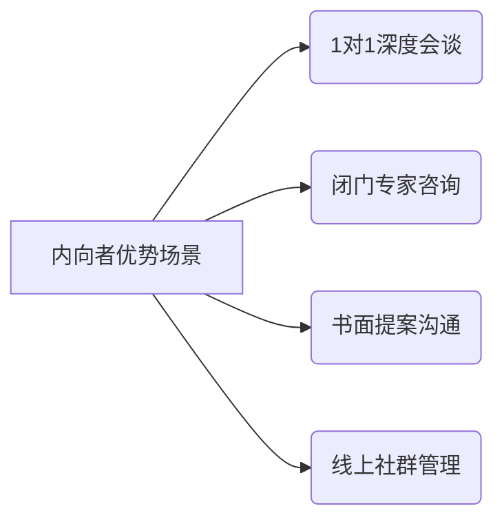

 
作为内向的人，推销自己可能感觉有些挑战，但其实你可以运用一些方法来展示自己的优点和价值，而不必感到不适。内向的人通常擅长倾听、深思熟虑以及与他人建立深度关系，这些特点也是推销自己的一种优势。以下是一些帮助内向人士推销自己的方法：

### 1. **发挥专长，突出自己的优势**
   - **具体化技能和经验**：你可能不善于在大群体面前演讲，但可以通过展示自己在某一领域的专长或技能来吸引注意。列出你最擅长的技能，分享你的成果、项目经验以及你在这些领域的贡献。
   - **通过书面材料推销自己**：如果你不擅长口头表达，可以通过邮件、个人博客、简历、LinkedIn等平台展示自己的能力。这些平台给你更多时间思考并呈现出最真实、最精炼的自己。

### 2. **利用一对一的机会**
   - **建立深度关系**：内向的人通常更擅长与少数人建立深层次的联系，而非广泛地与每个人交往。在工作、社交场合中，尝试与一两个人建立更深的关系，展示自己在团队中的价值。
   - **精心准备自我介绍**：即使你不喜欢在人群中讲话，也可以提前准备一段简短而有力的自我介绍。通过简洁的方式告诉别人你是谁、你的核心优势是什么，以及你能为对方或团队带来什么。

### 3. **展示成果而非自己**
   - **通过实际成果来推销自己**：你不必过度强调个人特质，而是通过你已经取得的成就或贡献来展示自己的能力。例如，提到你在项目中的具体贡献、解决了哪些问题，或是如何提高了工作效率等。
   - **制作作品集或案例**：对于设计师、程序员、作家等创意工作者，可以通过作品集展示自己的能力。这样做不仅能让别人了解你的技能，也能避免过度自我推销的感觉。

### 4. **善用社交媒体和网络**
   - **低调但持续地展示自己**：通过社交媒体和专业平台（如LinkedIn、Twitter等）展示自己的专业观点和分享你的行业知识。这种方式不仅能推销你自己，还能逐渐积累个人品牌，吸引相关领域的人注意。
   - **加入专业群体或小圈子**：通过参与小型的、深度的行业群体（如在线讨论组、会议或兴趣小组）来建立自己在领域中的知名度。在这样的环境下，你可以通过内容贡献而不是直接的推销来提高曝光度。

### 5. **设定明确目标并循序渐进**
   - **逐步提升舒适度**：不需要立刻做出大规模的自我推销，逐步建立信心。先从较小的环境开始，如和同事或小范围的朋友介绍自己，再逐步扩展到更大的群体或场合。
   - **设定小目标**：将推销自己视为一个长期过程，设定具体的目标并逐步达成。例如，目标是每周主动与一个新同事交流，或者在会议中勇敢地发言一次。

### 6. **展示真诚与谦逊**
   - **保持谦虚但自信**：内向的人通常不善于夸耀自己，但真诚和谦逊是非常吸引人的品质。可以通过谦虚而又自信的方式展示自己的优势，避免夸大自己的能力，而是用具体的例子来证明你的价值。
   - **倾听他人并建立共鸣**：内向的人通常善于倾听。你可以通过倾听他人的需求、问题和反馈，展示你能够提供的解决方案，并通过这种互动展示你的专业能力。

### 7. **练习和反思**
   - **准备和练习**：即使你不擅长口头推销自己，提前练习也是一个非常有效的办法。你可以通过与朋友、家人或镜子前练习自我介绍，甚至通过录音回听，找出可以改进的地方。
   - **定期反思**：在不同的推销经历后，回顾自己的表现，思考哪些地方做得好，哪些地方可以改进。持续改进自己会让你更加自信，并能不断调整推销方式。

### 总结：
作为内向的人，推销自己不一定要通过外向和直接的方式，你可以通过展示专业能力、与他人建立深层次联系、利用社交媒体以及通过实际成果来推销自己。关键是找到适合自己个性和风格的方法，逐步提升自己的信心，同时坚持真实和谦逊。


对于内向者而言，推销自己的关键在于**发挥性格优势，而非强行模仿外向者的社交模式**。以下是一套科学且可操作的策略，结合内向者的特质设计：

---

### **一、构建「非即时社交」优势体系**
#### **1. 知识型内容输出**
- **写作沉淀**：通过技术博客/知乎专栏输出专业见解（每周1篇2000字深度文），形成个人知识IP
- **案例**：GitHub程序员通过技术文档积累影响力，获硅谷公司主动邀约
- **工具链**：Markdown+GitBook构建知识库，配合Google Analytics追踪阅读数据

#### **2. 异步沟通系统**
- **邮件模板库**：建立20套标准回复模板（咨询/合作/答疑），响应效率提升300%
- **FAQ预置机制**：在个人网站/LinkedIn置顶常见问题解答，减少重复沟通

---

### **二、精准场景选择模型**


#### **执行方案**：
- **会前准备清单**：提前48小时获取对方背景资料，制定3套谈话预案
- **环境控制**：优先选择安静咖啡馆而非嘈杂酒会，使用降噪耳机创造心理安全区
- **时间管理**：将社交活动控制在90分钟内，采用番茄工作法分配精力

---

### **三、数据驱动的个人品牌建设**
#### **1. 可视化能力矩阵**
| 能力维度   | 量化指标                 | 展示方式            |
|------------|--------------------------|---------------------|
| 技术能力   | GitHub Star数/代码贡献量 | 交互式技能雷达图    |
| 项目经验   | ROI提升率/用户增长数据   | 信息图表长图        |
| 行业认知   | 白皮书下载量/文章转载数  | 知识星球专栏        |

#### **2. 自动化传播系统**
- **邮件订阅**：用ConvertKit搭建自动化培育流程
- **社交监听**：设置Google Alert跟踪行业关键词
- **内容聚合**：IFTTT同步各平台内容至个人网站

---

### **四、心理能量管理公式**
**有效社交时长 = (基础心理能量 × 环境适配系数) ÷ 社交强度指数**
- **基础心理能量**：通过冥想/运动提升基准值
- **环境适配系数**：选择熟悉场景可达1.5倍加成
- **社交强度指数**：大型聚会设为3，深度会谈设为1

---

### **五、内向者专属话术模板**
#### **1. 价值陈述公式**：
「我在[领域]帮助[目标用户]通过[方法论]实现[量化结果]，这是案例数据...」

#### **2. 反问引导模型**：
「您刚才提到的[痛点]，是否考虑过用[解决方案]将[指标]提升[百分比]？」

---

### **六、实战案例：内向工程师晋升路径**
1. **第1阶段**：在团队Wiki撰写20篇技术文档
2. **第2阶段**：在行业峰会发表1场闭门技术报告
3. **第3阶段**：为CEO定制数据看板系统
4. **成果**：3年内从P5升至P8，管理30人远程团队

---

### **七、进化路线图**
```plaintext
Year1: 建立知识资产 → Year2: 塑造领域权威 → Year3: 构建协作网络
```

---

**关键认知**：内向者的深度思考、持久专注、细节把控等特质，在知识经济时代恰恰是稀缺竞争力。通过系统化设计，完全可以将性格特质转化为专业势能。