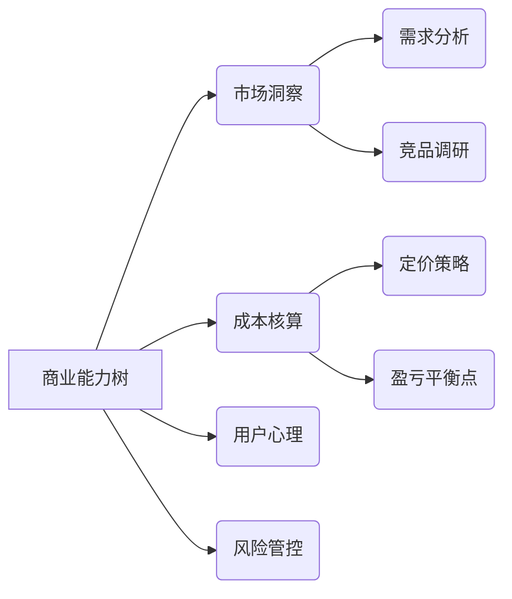

 
学习做生意，尤其是对于普通人来说，可以从多个方面入手。做生意不仅仅是有好的点子，还需要具备一定的商业知识、技能和心态。以下是一些可以帮助你从零开始学习做生意的途径和建议：

### 1. **学习基础商业知识**
   - **商业基础课程**：可以通过线上平台（如Coursera、Udemy、网易云课堂等）学习商业基础课程，包括市场营销、财务管理、运营管理、战略管理等。这些课程帮助你了解企业运作的基本原理。
   - **书籍**：阅读一些经典的商业书籍，帮助你建立起对商业的理解。推荐阅读以下几本书：
     - 《从零到一》 —— 彼得·蒂尔（Peter Thiel）
     - 《商道》 —— 王石
     - 《创业维艰》 —— 本·霍洛维茨（Ben Horowitz）
     - 《富爸爸穷爸爸》 —— 罗伯特·清崎
     - 《精益创业》 —— 埃里克·里斯（Eric Ries）

### 2. **参加创业和商业培训**
   - **创业课程和研讨会**：参加本地的创业讲座、商业培训班、创业营等活动。很多地方的商业协会和创业孵化器会定期举办免费的或低价的创业培训和讲座，帮助你学习商业实操。
   - **在线培训**：例如MOOC（慕课网）、LinkedIn Learning、Udemy等平台上，很多商学院课程是针对普通人设计的，涵盖了创意、管理、财务等内容。

### 3. **学习市场营销和销售**
   - **数字营销**：在现代商业中，营销和销售是非常重要的，尤其是数字营销。学习如何通过社交媒体（如微信、微博、抖音等）推广你的产品或服务，如何做好广告投放、SEO（搜索引擎优化）、内容营销等。
   - **销售技巧**：销售是做生意的核心之一。学习如何与客户沟通、了解客户需求、推销你的产品或服务，并能够建立长久的客户关系。可以参考一些销售技巧的书籍和在线课程，例如《销售的艺术》、 《影响力》等。

### 4. **学习财务管理**
   - **会计和财务基础**：即使你不是专业的财务人员，了解基本的财务知识也非常重要。你需要理解如何制定预算、做财务预测、管理现金流、计算利润和亏损等。
   - **财务工具**：学会使用一些财务软件，如Excel、QuickBooks、Xero等工具来进行账务管理，帮助你更好地管理企业资金。

### 5. **积累实践经验**
   - **小规模创业**：尝试从小生意开始，做一些小规模的创业，积累实际经验。例如可以尝试开网店、做个体经营、开设小型餐饮、做代购、做社交媒体销售等。通过实践，逐渐理解商业运作中的挑战和机遇。
   - **兼职或实习**：如果你没有资金和资源直接创业，可以选择在相关行业做兼职或实习，学习企业运营的各个环节，特别是那些你感兴趣的领域。

### 6. **学习如何管理团队**
   - **领导力和团队建设**：如果你的生意逐渐发展壮大，你可能需要雇佣员工。学习如何激励团队、管理团队的工作、协调不同的职能部门等管理技能是至关重要的。相关书籍如《高效能人士的七个习惯》可以帮助你提高领导力和团队协作能力。

### 7. **寻找导师或加入创业社群**
   - **创业导师**：找到一些有经验的创业导师或行业专家，向他们请教问题，获取他们的经验和建议。很多成功的创业者愿意为新手提供指导。
   - **创业社群**：加入一些创业者的社交圈子，参加线下的创业沙龙或线上论坛，结识同行，分享经验，甚至找到合作伙伴。

### 8. **学习如何面对风险和失败**
   - **风险管理**：做生意必然会面临风险，学习如何评估和管理风险是成功的关键。你需要准备好面对失败，并且从中吸取教训。
   - **调整心态**：做生意的过程中，会遇到很多挑战。学习如何调整自己的心态，如何保持积极的态度，并应对不确定性，是成功的关键因素。

### 9. **了解法律和税务**
   - **法律基础**：了解相关的商业法律、劳动法、合同法、税法等。确保你的生意合法合规，避免因疏忽而陷入法律纠纷。
   - **税务管理**：学习如何合理避税和报税，理解税务制度，确保企业在税务上的合规性。

### 10. **持续学习和改进**
   - **终身学习**：商业环境瞬息万变，不断学习是成功的关键。时刻关注行业发展趋势，了解市场需求变化，灵活应对市场的挑战。
   - **反馈和调整**：向顾客、合作伙伴和员工收集反馈，定期分析和调整你的商业模式和策略。

### 总结：
1. 学习基本的商业知识、财务管理、市场营销等。
2. 参加创业培训和讲座，提升自己的商业能力。
3. 实践创业，积累经验，最好从小规模的项目开始。
4. 找到一个导师或加入创业社群，和其他创业者互相学习。
5. 保持持续学习的态度，不断优化和调整自己的业务策略。

通过不断学习和实践，你会逐步掌握做生意的技能，并在过程中积累经验，最终实现商业成功。

对于普通人学习做生意，可以通过以下系统性方法逐步掌握商业逻辑并降低风险：

---

### 一、建立商业认知基础
#### 1. **学习商业底层逻辑**
- **推荐书籍**：
  - 《商业模式新生代》：用画布模型拆解商业9要素
  - 《精益创业》：最小可行性产品（MVP）方法论
  - 《穷查理宝典》：多学科思维模型构建
- **在线课程**：
  - 得到APP《刘润·商业通识》
  - Coursera《创业专项课程》（英/中字幕）
  - B站「硬核商业分析」系列视频

#### 2. **培养关键能力**


---

### 二、低成本实践路径
#### 1. **微创业试水**
- **案例参考**：
  - 社区代购：用微信群做生鲜团购（启动资金＜3000元）
  - 技能变现：PPT美化/短视频剪辑接单（零成本）
  - 二手交易：闲鱼专业卖家（聚焦细分品类如数码产品）

#### 2. **模拟经营工具**
- 《创业王》模拟经营游戏
- 沙盘推演：用Excel做虚拟店铺运营表
- 直播跟练：观察抖音小店运营全流程

---

### 三、实战进阶方法论
#### 1. **五步验证模型**
1. 需求验证：发放200份问卷/街头访谈
2. MVP测试：用「快团团」试卖样品
3. 数据复盘：计算转化率＞15%继续
4. 模式迭代：优化供应链/服务流程
5. 规模复制：建立标准化操作手册

#### 2. **风险控制技巧**
- 资金：遵循「3个1/3原则」
  - 1/3启动资金
  - 1/3备用金
  - 1/3坚决不动
- 法律：注册个体户（成本＜500元）
- 试错：单项目投入不超过积蓄20%

---

### 四、持续进化策略
1. **建立学习闭环**
```
每日：记录3条商业观察（客户行为/定价策略）
每周：拆解1个成功案例（用商业模式画布分析）
每月：参加线下交流会（创业咖啡/商会活动）
```

2. **构建资源网络**
- 加入「创业老兵」知识星球
- 参与36氪「未来企业家」社群
- 关注「虎嗅网」每日商业资讯

---

### 五、避坑指南
| 常见误区 | 解决方案 |
|---------|----------|
| "我觉得有需求" | 用「5Why分析法」验证真实需求 |
| 盲目跟风网红项目 | 做SWOT分析匹配自身资源 |
| 过度追求完美 | 遵循「完成比完美重要」原则 |
| 单打独斗 | 寻找互补型合伙人（技术+运营） |

---

**行动建议**：从明天开始，选择1个可立即落地的微创业项目（如朋友圈特产代购），按照「五步验证模型」在30天内完成首单交易。失败是最好的商业课，赚到第一块钱比空想100个创意更重要。

 
做生意的本质是 **创造价值并通过交换获得回报**。无论是大型企业还是小型创业项目，生意的核心都是通过满足客户需求、解决问题、提供商品或服务来创造价值，然后通过销售或其他方式获取收益。这一过程中，涉及到的关键因素包括产品/服务、市场需求、交易方式、利润和客户关系等。

### 具体来说，做生意的本质可以从以下几个方面来理解：

### 1. **创造价值**
   - **满足需求**：做生意的核心是发现并满足市场上的需求。无论是提供商品、服务还是创新的解决方案，生意的本质就是满足人们未被充分满足的需求，或通过创新提升现有需求的满足程度。
   - **解决问题**：每个成功的商业模式背后，都有一个在为特定群体解决某种问题。无论是通过更好的产品设计、更高效的服务，还是更实惠的价格，解决客户痛点是生意成功的关键。

### 2. **交换价值**
   - 做生意就是将自己的产品或服务与他人的需求进行交换。在这个交换过程中，商家提供客户需要的东西，而客户则给予商家相应的报酬（通常是金钱）。通过这种交换，双方都能从交易中获得自己想要的东西。
   - **双赢关系**：成功的生意建立在双方都能从交易中获益的基础上。商家获得利润，客户则获得价值或满足。

### 3. **盈利的动机**
   - 本质上，做生意的最终目的是**盈利**。每一笔交易、每一项服务、每一个产品，都是为了创造经济价值。企业通过将产品或服务销售给消费者获得收入，进而实现盈利。
   - **利润驱动**：虽然不是所有的生意都完全以利润为唯一目标，但大多数商业活动都围绕如何提高效率、降低成本、增加收入展开，以确保生意的可持续性。

### 4. **管理资源**
   - 做生意本质上还涉及到如何合理配置和管理资源。资源包括资金、人力、物资、技术等，如何通过有效的资源配置、生产过程优化、团队合作等实现最大效益是生意成功的关键。
   - **提高效率**：通过创新、技术进步、团队协作等方式，提高资源利用效率，不断降低生产成本，同时提高产品或服务质量。

### 5. **风险与不确定性**
   - 做生意本质上也意味着承担风险和不确定性。无论是市场需求波动、竞争压力、经济环境变化，还是突发的事件，商家在经营过程中总会面临一定的风险。因此，企业需要有策略来评估和管理这些风险，保持生意的稳定运行。
   - **长期视角**：成功的生意往往能够在风险中找到机会，并有韧性面对各种挑战。

### 6. **创新与适应**
   - 做生意还需要有创新精神和适应能力。随着市场环境和技术不断变化，企业必须不断创新产品或服务，调整商业模式，才能在竞争中脱颖而出。适应市场变化和客户需求的变化，是企业生存和发展的关键。
   - **持续进化**：无论是通过技术创新、市场拓展还是服务优化，企业要始终保持创新，以适应不断变化的商业环境。

### 7. **建立和维护客户关系**
   - 客户是生意成功的核心。做好客户关系管理，不仅能帮助企业获得更多的回头客，还能通过口碑传播吸引更多新客户。因此，生意的本质不仅是交易，更是与客户建立长期的、互信的合作关系。
   - **客户至上**：提供优质的客户服务、关心客户需求并建立忠诚度，能帮助企业在竞争中占据有利位置。

### 总结：
做生意的本质就是通过创造价值来满足市场需求，进行资源配置和管理，承受一定的风险，最终实现盈利。企业通过创新、提供高质量的产品或服务，以及建立稳固的客户关系，来确保商业模式的成功和长期发展。在这一过程中，生意不仅仅是交换商品和钱财，更是解决问题、创新、适应市场变化以及承担风险的综合过程。