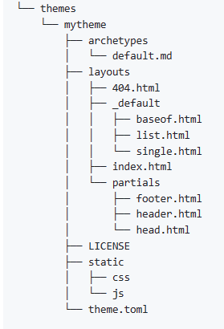

## 使用

Usage:
  hugo [flags]
  hugo [command]

Available Commands:
  completion  Generate the autocompletion script for the specified shell ,生成 cli 下自动完成脚本
  config      Print the site configuration 打印配置信息
  convert     Convert your content to different formats 格式转换,hugo convert toJSON/toTOML/toYAML
  deploy      Deploy your site to a Cloud provider. 发布站点
  env         Print Hugo version and environment info
  gen         A collection of several useful generators. 可以生成hugo 的 man ， markdown 文档
  import      Import your site from others. e.g. `hugo import jekyll jekyll_root_path target_path`.
  list        Listing out various types of content
     - all  list all ports  列出所有帖子，包括草稿，未来或过期的
     - hugo list drafts [flags]
     - hugo list expired [flags] 过期
     - hugo list future [flags] 将来

  mod         Various Hugo Modules helpers.
    - hugo mod init  初始化模块
    - hugo mod get github.com/gohugoio/testshortcodes  解决当前Hugo项目中的依赖关系
    - hugo mod clean 删除当前项目的Hugo模块缓存
     - hugo mod graph 打印模块依赖关系图
     - hugo mod npm  各种npm助手
     - hugo mod vendor 将所有模块依赖项提供到_Vendor目录中。
  new         Create new content for your site
     - hugo new [contentPath] 创建新内容
     - hugo new site [path] 创建新站点
     - hugo new theme [name] [flags] 创建新主题
  server      A high performance webserver 一个高性能的Web服务器
  version     Print the version number of Hugo

Flags:
  -b, --baseURL string             hostname (and path) to the root, e.g. https://spf13.com/
  -D, --buildDrafts                include content marked as draft
  -E, --buildExpired               include expired content
  -F, --buildFuture                include content with publishdate in the future
      --cacheDir string            filesystem path to cache directory. Defaults: $TMPDIR/hugo_cache/
      --cleanDestinationDir        remove files from destination not found in static directories
      --clock string               set the clock used by Hugo, e.g. --clock 2021-11-06T22:30:00.00+09:00
      --config string              config file (default is hugo.yaml|json|toml)
      --configDir string           config dir (default "config")
  -c, --contentDir string          filesystem path to content directory
      --debug                      debug output
  -d, --destination string         filesystem path to write files to
      --disableKinds strings       disable different kind of pages (home, RSS etc.)
      --enableGitInfo              add Git revision, date, author, and CODEOWNERS info to the pages
  -e, --environment string         build environment
      --forceSyncStatic            copy all files when static is changed.
      --gc                         enable to run some cleanup tasks (remove unused cache files) after the build
  -h, --help                       help for hugo
      --ignoreCache                ignores the cache directory
      --ignoreVendorPaths string   ignores any _vendor for module paths matching the given Glob pattern
  -l, --layoutDir string           filesystem path to layout directory
      --log                        enable Logging
      --logFile string             log File path (if set, logging enabled automatically)
      --minify                     minify any supported output format (HTML, XML etc.)
      --noBuildLock                don't create .hugo_build.lock file
      --noChmod                    don't sync permission mode of files
      --noTimes                    don't sync modification time of files
      --panicOnWarning             panic on first WARNING log
      --poll string                set this to a poll interval, e.g --poll 700ms, to use a poll based approach to watch for file system changes
      --printI18nWarnings          print missing translations
      --printMemoryUsage           print memory usage to screen at intervals
      --printPathWarnings          print warnings on duplicate target paths etc.
      --printUnusedTemplates       print warnings on unused templates.
      --quiet                      build in quiet mode
      --renderToMemory             render to memory (only useful for benchmark testing)
  -s, --source string              filesystem path to read files relative from
      --templateMetrics            display metrics about template executions
      --templateMetricsHints       calculate some improvement hints when combined with --templateMetrics
  -t, --theme strings              themes to use (located in /themes/THEMENAME/)
      --themesDir string           filesystem path to themes directory
      --trace file                 write trace to file (not useful in general)
  -v, --verbose                    verbose output
      --verboseLog                 verbose logging
  -w, --watch                      watch filesystem for changes and recreate as needed

Use "hugo [command] --help" for more information about a command.

## 图片路径

1. 绝对路径 /static/images/a.jpg


2. 相对路径 /content/post/demo/a.jpg
在文件 demo.md 中

> 文件名要与图片目录名字一致

pasteImage配置
```json
{
   "pasteImage.path": "${projectRoot}/static/images/",
}
```
## hugo theme
帮助文档链接 https://hugo.aiaide.com/



> 主题结构与生成的静态结构基本一致

### 自定义hugo主题--从内容页开始
为博文设计模板
/themes/study-theme/layouts/_default/single.html文件是所有内容页面默认的模板页面

single.html文件默认为空, 修改内容如下:

```html
<!DOCTYPE html>
<html lang="zh">

<head>
    <meta charset="UTF-8">
    <meta name="viewport" content="width=device-width, initial-scale=1.0">
    <meta http-equiv="X-UA-Compatible" content="ie=edge">
    <title>{{.Title}}</title>
</head>

<body>
    <div id="post" class="post">
        <article>
            <header>
                <h1 class="post-title">{{ .Title }}</h1>
            </header>
            {{.Content}}
        </article>
    </div>
</body>

</html>

```
模板中的{{.Title}}和{{.Content}}都是模板页面级的变量, 他们的值来至内容页中”Front Matter”中对应的字段. 具体本示例中就是/content/post/page1.md中的内容

Front Matter中常用的变量
title: 内容标题
date: 该页面的时间, 一般用来存放页面的创建时间.
draft: 如果true, 表示页面为草稿页, 内容不会呈现在网站中, 除非添加 –buildDrafts 给hugo命令.
keywords: 页面的关键字
description: 内容描述, 主要用于SEO优化.
weight: 列表页的文章排序, 值越小越靠前, 默认是按时间先后排序的, 也就是date中的值
模板页中常用的变量
.Title: 获取Front Matter中title的值
.Content: 获取文章的内容
.Date: 获取Front Matter中date的值
.Description: 获取Front Matter中description的值, 一般用于meta中的description字段
.Keywords: 获取Front Matter中keywords的值, 用于meta中的keyword字段
.Permalink: 获取页面的链接地址(URL)
.Next: 下一个页面
.Prev: 上一个页面
.WordCount: 内容的字数
.ReadingTime: 阅读内容的预估时间
.Pages: 当前列表页面下的内容页面的集合, 该变量在内容页模板的上下文中值为nil
.Site: 站点变量, 该变量下包含很多站点级别的属性和方法.
这些变量可以在官网找到 https://gohugo.io/variables/page/ 具体的含义可以逐步去试一下.

### 自定义hugo主题--内容列表页

内容页面的划分
根据内容页存放的位置, 内容页分为两种, 一种是存放在content根目录下面的内容页, 叫单页面(Single Page), 一种是存放在content子目录下的内容页, 叫章节页面(Section Page). 两者的区别是: 他们的Section属性不同, 章节页面的Section属性的值为页面所在的目录名, 单页面的Section属性的值为空字符串, Type属性为page.

这里给内容页面添加列表页主要是给章节页面添加列表页.

为所有的内容页面添加一个列表页.
在前一篇DEMO的基础上我们多添加了几篇博文, 和一个_index.md文件. content目录的结构如下

```
└── content
    └── post
        ├─ _index.md
        ├─ page1.md
        ├─ page2.md
        ├─ page3.md
        └─ page4.md
```
_index.md就是post目录下面所有博文的列表页. 它对应的默认模板文件在: layouts/_default/list.html.

现在修改list.html内容如下

```html 
<!DOCTYPE html>
<html lang="zh">
<head>
    <meta charset="UTF-8">
    <meta name="viewport" content="width=device-width, initial-scale=1.0">
    <meta http-equiv="X-UA-Compatible" content="ie=edge">
    <title>列表页面</title>
</head>
<body>
    <!-- {{ with .Site.GetPage "/post" }}<a href="{{.Permalink}}">{{ .Title }}</a>{{ end }} -->
    {{  range .Pages }}
        <div>
            <a href=".Permalink">{{.Title}}</a>
        </div>
    {{  end  }}
</body>
</html>
```
range: 可以用来遍历集合, .Pages变量获取的是当前当前章节下说有的内容页的集合. 如本例中, 访问post章节下的列表页, 这时.Pages包含的就是post目录下的所有文章.

在遍历的时候, 每次循环的上下文就是每个内容页面, 内容页面模板中的变量都可以使用的.

为内容页面添加上一页和下一页
这里主要使用到了内容页模板中的 .NextInSection 和 .PrevInSection 变量, 他们表示当前章节中, 按时间倒序排列的文章集合的后一篇文章和前一篇文章.

```html 
<!DOCTYPE html>
<html lang="zh">

<head>
    <meta charset="UTF-8">
    <meta name="viewport" content="width=device-width, initial-scale=1.0">
    <meta http-equiv="X-UA-Compatible" content="ie=edge">
    <title>{{.Title}}</title>
</head>

<body>
    <div id="post" class="post">
        <article>
            <header>
                <h1 class="post-title">{{ .Title }}</h1>
            </header>
            {{.Content}}
            <br />

            <div>
                {{with .NextInSection}}
                <a href="{{.Permalink}}">前一页</a> 
                {{end}}
                {{with NextInSection}}
                <a href="{{.Permalink}}">后一页</a>
                {{end}}
            </div>
        </article>
    </div>
</body>

</html>
```

### 自定义hugo主题--网站首页

首页也属于列表页, 只是他是一个特殊的列表页. 如果没有给首页添加模板, 首页使用内容页的模板.

DEMO的目录结构
```
├─content
│  ├─news
│  └─post
├─data
├─layouts
├─static
└─themes
    └─study-theme
        ├─archetypes
        ├─layouts
        │  ├─index.html
        │  ├─partials
        │  └─_default
        └─static
```

首页模板的位置
/themes/study-theme/layouts/index.html 首页模板使用单独的模板, 模板的名字也是固定的 index.html. 也可以给首页添加一个markdown文件, 位置在content根目录下, /content/_index.md. 这个不是必须的.

在首页中展示各章节的文章列表
首页是整个网站的一个索引, 我们一般会在首页中展示各个板块的文章列表, 在本DEMO中我们添加了两个板块, 也就是/content目录中的news 和 post这两个章节目录, 现在我们把这两个章节的内容添加到首页中.
```html
<!DOCTYPE html>
<html lang="zh">

<head>
    <meta charset="UTF-8">
    <meta name="viewport" content="width=device-width, initial-scale=1.0">
    <meta http-equiv="X-UA-Compatible" content="ie=edge">
    <title>网站首页</title>
</head>

<body>
    <h2> 新闻列表 </h2>
    {{ range where .Site.RegularPages "Section" "news" }}
    <div>
        <a href="">{{.Title}}</a>
    </div>
    {{ end }}

    <h2> 博文列表 </h2>
    {{ range where .Site.RegularPages "Section" "post" }}
    <div>
        <a href="">{{.Title}}</a>
    </div>
    {{ end }}
</body>

</html>
```
这里主要用到两点

.Site.RegularPages 表示网站下面的所有节点内容, 具体到本例, 就是news和post目录下的所有文章
where 是一个函数, 用来查询集合中符合条件的项目.
where 的语法: where COLLECTION KEY [OPERATOR] MATCH

where .Site.RegularPages "Section" "news" 的含义就是, 查找出section属性的值为news的项目
### 自定义hugo主题--导航菜单

设置导航菜单的位置
在根目录下的 config.toml 文件中配置导航菜单, config 文件支持三种文件格式: toml, yaml, json, 可以使用自己熟悉的格式. 使用对应的格式需要修改对应的扩展名. 不推荐使用 JSON 格式, 因为 json 不支持注释, 在配置文件中添加注释是非常有必要的.

通过.Site.Menus 变量获取到设置的菜单信息, 下面以 toml 格式为例展示导航菜单的使用.

添加主导航菜单和页脚导航菜单

```toml
# 主导航菜单
name="首页"
url="/"
weight="1"
[[menu.main]]
name="博文"
url="/post"
weight="2"
[[menu.main]]
name="新闻"
url="/news"
weight="3"
[[menu.main]]
name="关于"
url="/about"
weight="4"

# 页脚导航菜单
[[menu.foot]]
name="网站首页"
url="/"
weight="4"
[[menu.foot]]
name="博文集合"
url="/post"
weight="3"
[[menu.foot]]
name="新闻列表"
url="/news"
weight="2"
[[menu.foot]]
name="关于我们"
url="/about"
weight="1"
```
获取菜单的代码如下”
```html
 <h2>主导航菜单</h2>
<ul>
  {{ range .Site.Menus.main }}
  <li><a href="{{.URL}}">{{.Name}}</a></li>
  {{ end }}
</ul>

<h2>页脚导航菜单</h2>
<ul>
  {{ range .Site.Menus.foot }}
  <li><a href="{{.URL}}">{{.Name}}</a></li>
  {{ end }}
</ul>
```
.Site.Menus后面接的是在 config.toml 中定义的表名

定义多级菜单
```toml 
[[menu.main]]
name="首页"
url="/"
weight="1"
[[menu.main]]
name="博文"
url="/post"
weight="2"
[[menu.main]]
name="新闻"
url="/news"
weight="3"
[[menu.main]]
name="关于"
url="/about"
weight="4"
[[menu.main]]
name="子菜单"
weight="5"
[[menu.main]]
parent="子菜单"
name="子菜单1"
weight="2"
[[menu.main]]
parent="子菜单"
name="子菜单2"
weight="1"
```
获取菜单的代码如下:

```html 
<h2>主导航菜单</h2>

<ul>
  {{ range .Site.Menus.main }} 
  {{if .HasChildren}}
  <li>{{.Name}}</li>
  <ul>
    {{ range .Children }}
    <li>
      <a href="{{ .URL }}">{{ .Name }}</a>
    </li>
    {{ end }}
  </ul>
  {{ else }}
  <li><a href="{{.URL}}">{{.Name}}</a></li>
  {{end}} {{ end }}
</ul>
```
子菜单项比普通的菜单项多了一个属性parent, 用于设置父菜单的ID, 这里用的是Name的值, 如果name的值不重复, 一旦重复就会产生意想不到的效果. 正确的做法是使用Identifier的值.

导航菜单常用的属性
.Name: 菜单想的名称, 如果Name的值重复了, 要想使其生效, 需要为其设置Identifier属性
.Identifier: 菜单想的唯一标识, 值不能重复.
.Weight: 用于设置菜单项的排序, 值越小排名越靠前.
.Parent: 设置父菜单的ID.
.URL: 设置菜单项直向的URL地址.
当行菜单常用的方法
.HasChildren: 判断是否包含子菜单. 如果有子菜单则返回true
### 自定义hugo主题--标签和分类
