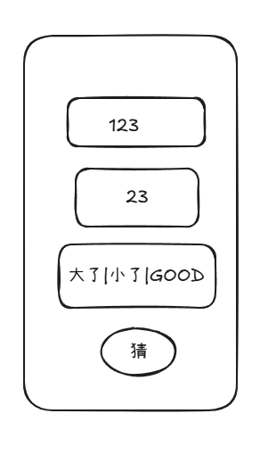

- 配置 翻译 ctrl 鼠标翻译
- 做一个 app 猜数字游戏 flutter

配置markdown 预览快捷键

	{
		"key": "ctrl+q",
		"command": "markdown-preview-enhanced.openPreviewToTheSide",
		"when": "editorLangId == 'markdown'"
	},
	{
		"key": "ctrl+k v",
		"command": "-markdown-preview-enhanced.openPreviewToTheSide",
		"when": "editorLangId == 'markdown'"
	},
## 规划人生
时间分配
1. 工作
2. 投资
3. 兼职（剪短视频）
4. 娱乐 (1小时游戏)

## 专注事业

- 1. 翻译 https://x.com/theoscarhoole 这个人的全部文章到博客作为长期工作任务
- 2. 在咸鱼,淘宝 搜关键词 卖东西  如搜索 特朗普
- 3. 过完计算机书籍
- 4. 兼职（端盘子），做培训（剪视频，编程）
- 5. 找业务兼职，我要做高技术的，我不喜欢接触人花费时间

找工作 -> 投资  
在犯错中学习。
积极处理力所能及的事情，比如网上回答问题。
抄糙超

## 其他

1. 给外面 兼职还没找到活，先给自己 打工兼职，维护博客内容 （并插入广告）
2. 学习的时候 想象各个项目的商业化，和自己博客的商业化，客流量，直播人物的商业化。
3. 商业化广告

