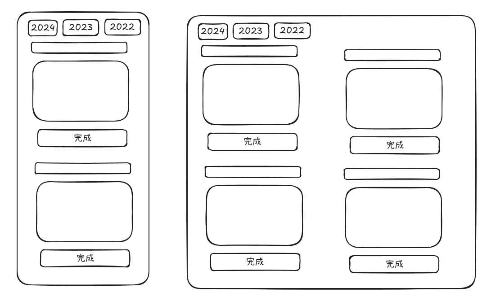

 这本书讲的主要内容是什么，观点科学吗

## 10月项目 

- 趋势是  远程，全球化
- 1. 做个博客，发点推广
- 2. 做一个 任务办理清单 (前提 react tailcss)
- 3. 找到 下一个项目
- 4. 把互联网  **爱好**  当工作
- 5.  盈透,出金费用 10$,但每月限免一次，准备 月定投(很平稳) VOO 和 QQQM  1 股，因为很贵 ,查下哪个出金ocbc最便宜，和 wise 如何出金

个人觉得国内资金入金美股账户(以盈透证券为例)损耗最小的方式是：

1、国内中银购汇港币，0费率，换汇成本不低
2、国内中银港币汇款至香港中银，0费率
3、香港中银港币转数快存入资金到盈透证券，0费率
4、盈透内兑换货币，港币换美元，换汇成本低

纳指的QQQ是管理费最低的，
只有0.02%。
## 今年项目计划

- 1. 做个博客，发点推广
- 2. 做一个 任务办理清单

