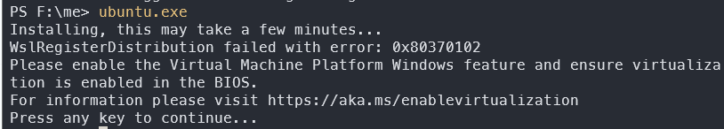

- [理论基础]人工智能的发展，使得普通人能更方便产生内容，信息不再垄断，使得普通人能挣钱。

## 使用中文编程

进度 1， 创建 zhong.py 文件
进度 2， 使用想象，转为文字描述
进度 3，

## 考虑日本旅游

进度 0，

## 做老板思维，只审核，不工作

进度 1，

##  大胆想象并行动，行动是第一生产力
进度 1， 进度9

## 因为思维是我的缺陷，所以只能整理资料

进度 1，

## 英语听力 
进度：0

## 整理PDF资料，转成视频
进度: 0

## 作图学会了，学前端，审核在小红书

### 导航站 
进度： 1,2

## 数据科学

进度 1，

## 做开源机器人，缓解自己的孤独

进度 ：  1，

##  B 站看独立开发者视频和游戏开发，与独立开发者交流
进度 ： 0

## 卖人设最挣钱，因为会有广告
进度 ： 0

## 表达真实,做简单情绪图片

进度：0

### 出闲置

进度： 50

- 在咸鱼,淘宝 搜关键词 卖东西  如搜索 特朗普，大豆油，大润发卡

### 老视频修复

进度：0

10元一张，超过10张 5元1张

找个软件，并修复