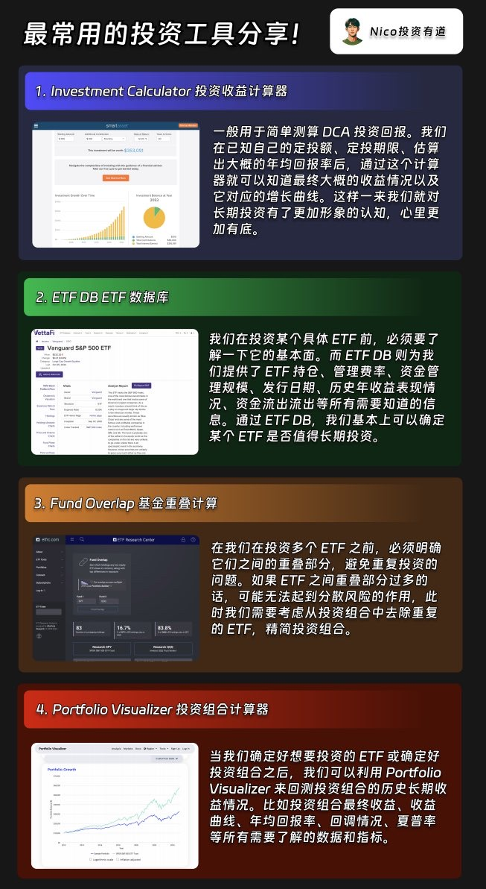

## 简单的东西很难卖出去，因为简单的东西看起来很容易，谁愿意为容易买单呢？

商人们早已明白这个秘密，容易的东西往往被包装成复杂的东西，让用户觉得它很特别，从而为这种特别性付出高价。

## 睡沙发适合创业

## 第一桶金是最难的，我们该怎么做呢？

1. 刚毕业，把市场上各行各业的机会都看一下，首先考虑技能价值高的工作，也就是工资高、单位时间赚钱多的。比如学编程、学AI。

2. 通过投入时间学习来提高此项技能，让技能先在单个点上突破。

3. 此过程的思路：用时间换技能，用技能换现金，把现金换成资产。

4. 存钱是核心。控制开支，不要买让你看起来富的东西 。

5. 也可以利用工资流水取得低息贷款，然后投资于优质资产。

6. 提升认知。不要沉迷刷短视频打游戏，买好车、大房子以及其他周围的人都在做的事情，把精力集中在提升认知的事情上。

7. 提升认知是个漫长的过程，你需要观察、思考、试错、总结。认知提升了，你才能“看见”适合当下的好机会。

最后直白总结：好技能，高工资，多存钱。

投资工具
