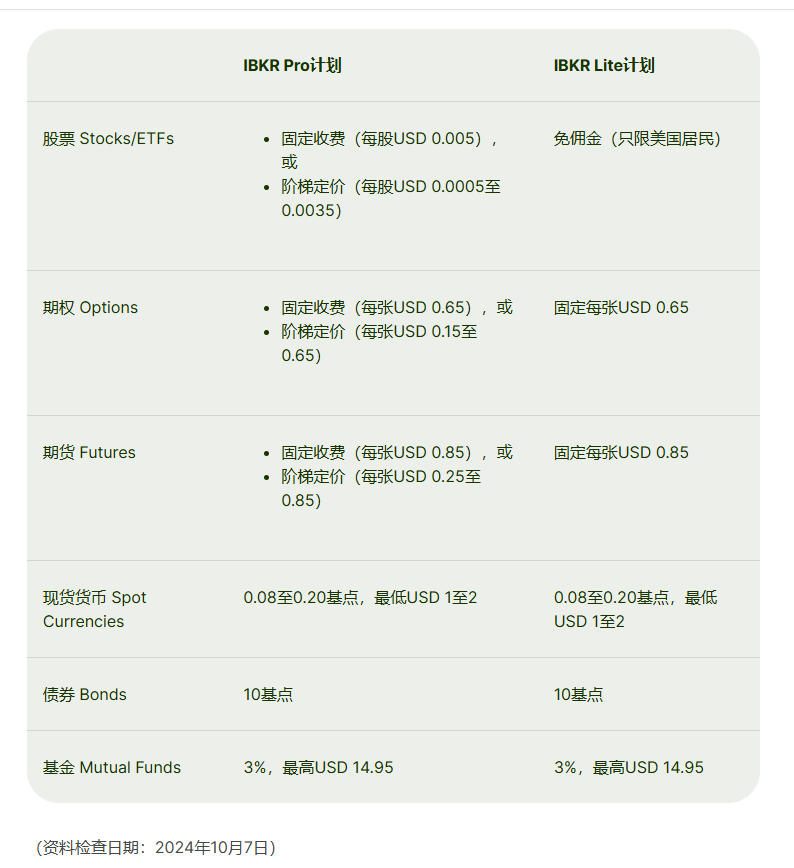

股市：
外国:   绿涨红跌
我国： 红涨绿跌

投资可以分为多种类型，选择一个好的市场取决于你的财务目标、风险承受能力、时间框架和个人偏好。以下是投资的主要类型和如何选择好的市场的一些建议：

定投： 
 SP500 NADASQ DJI QQQ

注意：买VOO

香港银行卡 : 工银亚洲 (要去香港），中银香港，建行亚洲最好，毕竟卡在国内可以取现，国内转账过去，手续费极低，速度还很快，基本很少拦截的，其他的恒生，汇丰，转出去拦截时有，手续费还贼贵。

盈透收费

穷查理宝典先看看，其次富爸爸穷爸爸、小狗钱钱、纳瓦尔宝典也不错。视频可以看小林说，或者油管上按关键词搜视频看。
### 投资类型

1. **股票投资**：
   - **概述**：购买公司股票，即拥有该公司的一部分股权。股票市场包括公开交易的公司（如上市公司）的股票。
   - **特点**：潜在回报高，但波动性大，风险较高。适合希望通过资本增值获利的投资者。
   - **适用人群**：中长期投资者，能够承受较高风险并愿意等待市场波动的人。

2. **债券投资**：
   - **概述**：债券是企业或政府发行的借款票据，投资者购买债券等于借钱给发行人，发行人定期支付利息，到期偿还本金。
   - **特点**：相对风险较低，固定收益，但回报率通常低于股票。
   - **适用人群**：风险承受能力低、追求稳定收入的投资者，如退休人员。

3. **房地产投资**：
   - **概述**：购买土地、住宅、商业地产等实体资产或投资于房地产投资信托（REITs）。
   - **特点**：实物资产投资，具有保值特性，长期收益可观，但流动性差。
   - **适用人群**：愿意长期持有且有一定资本实力的投资者。

4. **基金投资**：
   - **概述**：投资者将资金汇集在一起，由基金经理进行多样化投资。基金类型包括股票型基金、债券型基金、混合基金、指数基金等。
   - **特点**：多样化降低风险，专业管理，但通常有管理费用。
   - **适用人群**：对市场缺乏专业知识或时间精力的投资者。

5. **贵金属投资**：
   - **概述**：投资于黄金、白银等贵金属，通常通过实物购买、交易所交易基金（ETF）或期货市场。
   - **特点**：避险资产，抗通胀，但波动较大。
   - **适用人群**：寻求对冲风险或保护资产价值的投资者。

6. **外汇投资**：
   - **概述**：通过外汇市场交易不同国家的货币，以赚取汇率变动的差价。
   - **特点**：市场波动大，风险高，但流动性强，适合短期交易。
   - **适用人群**：具有高风险承受能力和一定技术分析能力的投资者。

7. **加密货币投资**：
   - **概述**：投资于比特币、以太坊等加密货币，通常通过加密货币交易所进行买卖。
   - **特点**：高风险、高回报，市场不稳定且波动性大，适合愿意承担高风险的人。
   - **适用人群**：高风险偏好者和技术爱好者。

8. **另类投资**：
   - **概述**：包括私募股权、对冲基金、艺术品、收藏品、酒类投资等非传统资产。
   - **特点**：流动性差、进入门槛高，但有可能获得独特的高回报。
   - **适用人群**：有较高风险承受能力和多样化需求的高净值人士。

### 如何选择好的市场

1. **明确投资目标和时间框架**：
   - 短期目标可能需要选择高流动性的市场（如股票市场或外汇市场）。
   - 长期目标可能适合选择增长潜力大的市场（如房地产市场或股票市场）。

2. **评估风险承受能力**：
   - 风险承受能力高的投资者可以选择波动性较大的市场（如股票、加密货币、外汇等）。
   - 风险承受能力低的投资者应考虑低风险市场（如债券、基金或贵金属）。

3. **研究市场表现和趋势**：
   - 通过分析市场的历史表现和趋势，了解其波动性、增长潜力和风险。使用技术分析（如K线图、趋势线）和基本面分析（如经济数据、公司财务报告）来判断。

4. **了解经济环境和政策影响**：
   - 市场表现通常受到经济环境和政策的影响（如利率变化、税收政策、地缘政治因素等）。在选择市场时，要了解相关国家或地区的经济状况和政策趋势。

5. **多样化投资组合**：
   - 分散投资于不同的市场和资产类别，以降低单一市场风险。这种策略能帮助你在一个市场表现不佳时，依赖其他市场提供的潜在回报。

6. **咨询专业建议**：
   - 如果对市场了解不深，可以寻求专业的财务顾问或投资顾问的建议，以便做出更明智的决策。

7. **关注全球市场动态和创新领域**：
   - 全球化趋势和技术进步带来了许多新兴市场和投资机会，如绿色能源、人工智能、医疗科技等新兴行业，可能为投资者带来独特的增长机会。

### 总结

选择好的市场需要综合考虑个人的投资目标、风险承受能力、经济环境、市场趋势和多样化需求。定期评估投资组合的表现，并根据市场变化和个人财务状况进行调整，是成功投资的关键。
