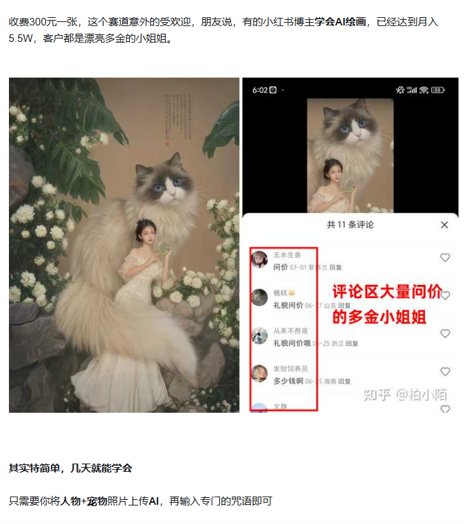

## 勇气

20秒的勇氣是我最大的收穫

## 死亡

“别因为你要死了才去做或者不去做某件事情，而是要找到自己认为重要的事情，不管什么时候，只要去做”，当死亡驾临之时，已经没有了内心的束缚，眼前所看到的一切都已发生变化，也正是哪个时候的自己，才是凭着自己的内心过活，拿捏得清楚什么是最重要的事情。

# 焦虑

深呼吸
relax音乐

# 创作

# 目标设置的合理性
如何判断目标是否恰当呢，我的经验是：「有趣且有挑战」，比如：

我要减肥并不是很好的目标，我想在沙滩上秀腹肌给一群妹纸看就好多了，你可以在每次健身和节食的时候都想象下那个画面
我要提升英语并不是很好的目标，我想一个人去国外旅游，欣赏国外的美景，尝遍国外的美食，这个画面就比较有意思了
我今年要看完二十本书并不是一个很好的目标，我想提升自己的结构化思考力，在跟人聊天、演讲、汇报的时候更顺利，这就有点动力了

# 奋斗了10年

外快是怎样挣来的。
我想说的是，应该摸清你公司之运营规模，利用其漏洞不犯规的去挣钱。
那应该才是最接地气，又不靠工资得到收入的最好办法。

————————故事如下———————
从毕业到现在，换了很多份工作（以前答案有，无法再说，累）
因为个人的原因，觉得，钱不是公司给你的，是看你自己怎么争取的。
第一个1万记忆犹新，毕业的第一份工作就是商务中心助理。（其实就是写字楼物管）
上头有一个主管，做了4年的“呆板”姐姐，就是做资料，串门，聊天。
所做的工作就是，续合同。催租啊，发水电单啊，电梯啊，宣传啊，工商注册啊，
等等等等做的非常琐碎。
一整层楼，大约有70间办公室需要出租，我们的米饭班主。
公司有专门的销售，还有相合作的地产中介，负责办公室的租赁率。
提成是。销售自己客户，半个月租金+300，合作地产，一个月租金。我们。200块奖金
每个月大概都有空置10间左右，销售会约客户在我们带领下看房间。（我们地主啊）
经常有上门询问的客户，我们就登记再分派给各个销售。
进去第一个月，学习了各种繁琐东西，新人，阿姨请假，连地都拖了。眼见功夫，非常的容易学习，就是够耐心就好。所以边学习，我也边摸清公司销售的介绍套路。
到了第二个月，不甘寂寞的我，开始截留上门客户资料，自行的带客参观。之后，在朋友介绍下认识了一个地产中介。
我发现的是，销售们其实也是经常在相熟的地产那，接受一些客户，或者自己的渠道内去找客户，最多是在中介网发布信息，可是，许多创业论坛他们都忽略了
发现了之后果断行动，每天工作完之后，上网在各种论坛发布租赁信息，
特别在学校的大三圈子里，各种宣传。
大概有接待了20个客户以后，迎来了第一春
第一个客户，是接待了一个上门客户，两次看房，各种软磨硬泡。亲娘般的。才肯签合同。
因为只有200块，我又联合了认识的地产中介，用他的名义，跟公司申报。（其实只要一个名片
当时的房间是150平，80一平，12000.。签了合同立马给钱，上交公司。
第三天，就下来佣金，分给了中介2000块。我去，10000块到手了。
10000块，泪流满面好吗。各种暗爽。给我的工作增加了太多动力，每次发完水电单，老子的想法就是，我擦，今儿有客户上门吗？

这之后，以后的工作，我都会特地留意其工作销售人员的工作架构，什么客户，提成分配，我是否有此类能力以及资源。

第二次挣钱。
当时楼层出租50多个房间，那就代表是50多个公司，各行各业，每个行业都有，
因为缴款单都是我发的原因，所以每个公司我都熟悉，而我也是有意识的去结交认识各个业主。
感觉每一个能老板，周边必定有利益输送，不管多少，总有机会
之后有一天，就有个老板，收欠款，扣回来了一堆的电子零件，不知道怎么出手，
我知悉状况以后，感觉，哎哟，有机会。
上网查询了电子零件型号，找了一个朋友了解情况，联系。周转之后找到了一个人收货。
刚好又是工厂需要的，检查没问题，立马就回收给钱
记得当时是25万的货，给了8000 元的中介费。我擦，来多两个欠款的好吗。？

第三次挣钱，工作终结篇。
有一个手机公司，在连拖三个月租金，之后在一个晚上，老板突然跑路。员工也失踪了。
留下了一堆破铜烂铁，桌椅，还有没用的资料。
主管搬清了所有办公用品之后，剩下的破铜烂铁，丢弃在空置房间。
其实里面还有相当一部分的手机CPU。主管每天对其都是虎视眈眈的，觉得就是值钱的东西
连公司检查时，她也是将CPU藏了起来的，如此狼子野心，呵呵，别怪我。
本人因为接触人士较多，发现了破铜烂铁里面，有非常多的手机主板元件，那可是都金子。
之后主管带了几个CPU，去了华强北，因为那些CPU实在一般。又是旧型号，根本没人要
跟我坦白，让我问熟人，要不要回收。嘿嘿。
我跟主管承担了找人收购CPU的任务，说有朋友做这个，1块钱一个回收，还可以看看破铜烂铁有没值钱的（有个蛋朋友做，只能说我意在沛公）
之后找了大学同学过来。在收购CPU之余，顺手500块一箱的价格，吧所有东西都回收了。
当然也包括那5箱主板。
之后是出门就把5箱主板之外啊的东西丢到了垃圾站。
5箱主板卖了4万多块。（3000一斤）收货收了5000多。
总结，收入30000来。

____________________________________________
2天没睡觉了，是否会有点语无伦次。
大总结就是，在工作的半年期间，一个月平均一个客户，但是因为我的原因，公司禁止了管理人员参与销售，其实这是个愚蠢的决定，因为销售不够，根本忙不过来。流失很多客人，之后我非常的愤怒，果断辞职，第三次挣钱，也是在走前做的。无奈。

待更新，睡觉
_________________________________________________update————————
说了要更新，就补齐吧。谢谢赞的亲。

外快的经历，其实还包括：

当时大学的时候，附近的宜家家居开张，紧缺人手，因为近所以便去面试。
结果还过了，协调后排班后，基本上开始是周末上班，
后期的话，白天都是早上有课，一般下午也就2节课，我也就白天上课，晚上上班。
问题来了，宜家的员工卡，85折。一听到这问题，2话不说，开始代购。
基本上，我一个月大概有1500的折扣份额，5%便宜给顾客，我挣10%
如果货品没有什么后期问题，（基本没有，除了2个亲戚的）你挣得都是没手尾的钱。
再之后，1500无法满足我的要求了，我又团结了3个同事，
分成30%，我找客户，利用了他们的份额，基本上一个月能盈利到几千块。
关键在于，你必须摸清一个购买时间，一个月分几次，还有不要和收银部的人太熟。千万不要。
当然，一切一切要你把你本身的工作做好，当你是一个工作能力好，给人感觉不错的人，你做这些工作外的东西，别人都会对你给予宽容或者帮助。
我觉得工作一定不要只想着工资，你必须做工作外，更多的东西，那是外快，其实也是学习，
切勿破坏工作原则，破坏公司利益，或者损坏别人利益，这样得不偿失。
比如当时做高档橱柜销售的时候，话说我是把公司旁边配套的高档家私都混的很熟，
在客户买了我们橱柜的时候，我们会出效果图，就会把一些款式放进去，
到最后客户看的时候，满意我们橱柜了以后，就顺便询问，以及介绍下旁边的东西。
一举两得，不过这事儿其实我也就做成了1次，卖了一张床。可是因为要这么做对于欧洲家具的认识，却是多了许多。

—最后的结果是，商务助理，因为禁止销售，公司新开了一个推广部让我做见习主管，因为不满禁止，辞职了（年少轻狂）。宜家家居，后期因为毕业辞职了，也是好运气，因为做的时候刚开店，后面公司是禁止代购，有别的同事因为做这个，被开除了。

做了这么多分工作，没有被开出过。做好本身的工作，甚至出色，领导对于你的行为，也是有适当的放宽。这是外快首先准则。

各位兄弟加油，努力共勉。~

# 手游

以前同学工作的游戏公司，有一个sb mmorpg手游（基本靠抄袭，没啥成本），没啥稳定玩家，只有1个土豪经常上线，而且一个月就能充20万，可以说团队都靠他在养这个游戏主打pvp，但是因为人越来越少，土豪上线也越来越不稳定，搞得老板很紧张，最后紧急开了个会，决定公司里从程序到设计，从老板到保洁，10来个人全部上阵，充当玩家过去让土豪老板杀过瘾，而且要变着法搞小号、死的也要不情不愿、要欲拒还迎、要反复报酬，以求吸引土豪老板。效果显著，土豪又玩了俩月，听说他们那个公司除了这个土豪，其他玩家镚儿毛不花，但这个土豪里里外外甩了得有200多万。

情绪价值给到位了，毕竟是衣食父母

哈哈哈，这和小马哥刚刚开发QQ时，自己搞个女性角色，天天找人聊骚一样的道理。

# 知乎商业
https://www.zhihu.com/question/571005780/answer/3574342170

# 编程

https://www.zhihu.com/question/629894384/answer/3323541406

https://www.zhihu.com/question/38560404/answer/3569922166