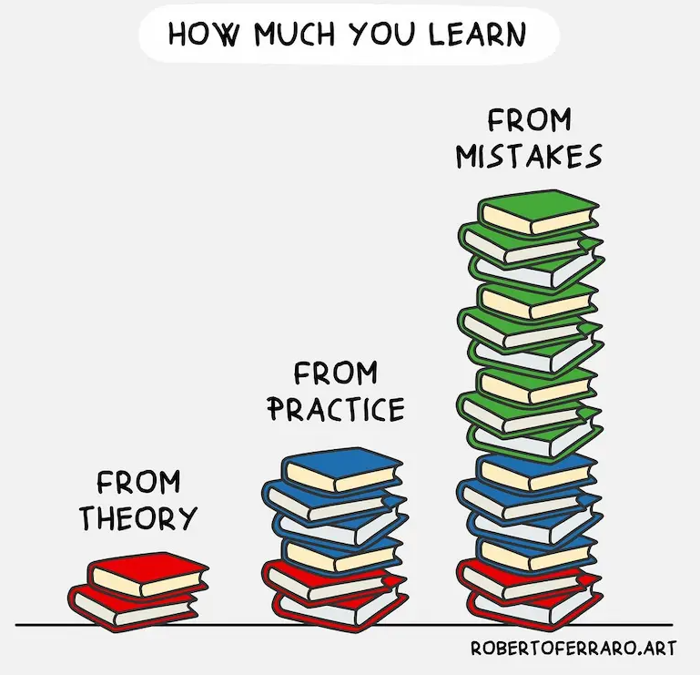

## 人生定位：年轻积累财富(目标达成越早越好)，老了环游世界 

- 追求收入，享受自由人生，然后培养兴趣
- 技能增长最快的方式就是 实习，工作。
- 世界是平的，相对是自由的
- 向前看，不要回味过去，多设想未来(环游世界)，积极探索
- 面对问题，人的内心有两个自己，一个是积极的，一个是消极的，用积极击退消极，它使人成长。
- 用想象来辅助思考或记忆
- 学习改变认知，行动改变习惯。活用知识才是掌握知识。
- 保持冷静，安静，远离垃圾信息。
- 世界一直在改变，新事物一直出来

## 收获最多的学习途径

书本知识只是基础，实践应用可以学到更多，如果实践发生错误，那就是最好的学习机会。

就是在犯错中学习，有目标的学习。