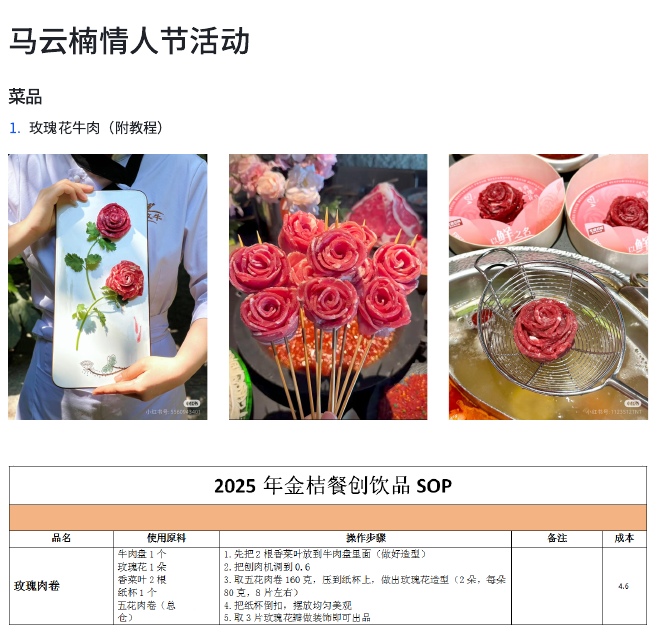
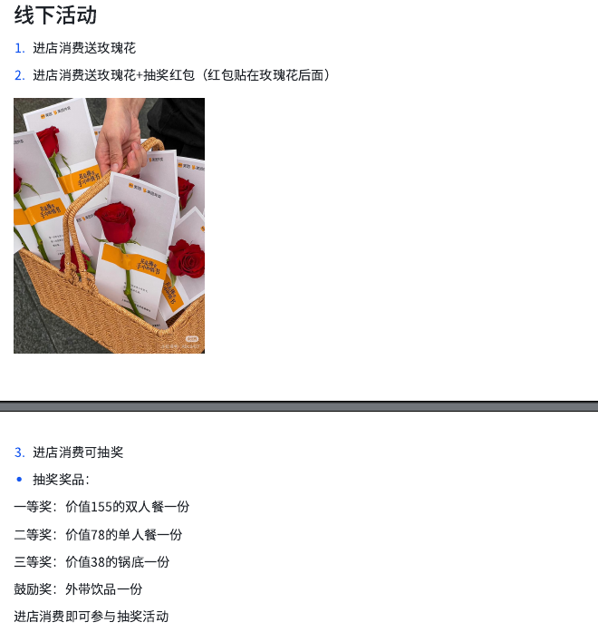

## 餐饮运营

情人节活动

## 作为小红书上的博主，告诉我应该怎么做好茶商，怎么写好笔记。如何设置价格范围，如何提高销量

作为一位刚开始创业的茶商博主，在小红书上开设 account 需要精心策划和一步步实践。以下是一个有条理的步骤指南，帮助你成功运营这个 account：

### 1. **确定个人定位与风格**
   - **目标定位**：明确你是想以高端、自然或亲民的方式呈现茶叶。
   - **风格选择**：保持轻松自然的语气，不使用广告感。

### 2. **选品策略**
   - **产品选择**：涵盖普洱生茶、熟茶、黑茶等主流类型，确保覆盖不同口味和预算范围。
   - **包装设计**：选择性价比高的茶袋和包装设计，提升产品的亲和力。

### 3. **价格制定**
   - **成本核算**：确定茶叶的成本价，合理设定售价区间（建议15-25元）。
   - **利润空间**：确保定价既能覆盖成本，又有一定的盈利空间。

### 4. **内容创作计划**
   - **笔记类型**：写推荐款型的使用教程、茶叶知识分享和品牌对比视频。
   - **互动方式**：在文末询问读者喜好或问题，促进互动交流。

### 5. **运营策略**
   - **内容频率**：每日发布1-2条笔记，保持内容的新鲜感。
   - **物流关注**：确保仓库存储茶叶，并及时处理物流问题。
   - **平台联动**：除了小红书，还可以在微信公众号、抖音等平台推广。

### 6. **营销活动设计**
   - **互动活动**：发起如“今天喝什么茶？”的互动投票。
   - **限时优惠**：设置折扣活动吸引粉丝购买，提升转化率。

### 7. **数据分析与优化**
   - **内容效果分析**：定期查看笔记和视频的表现数据，了解受欢迎的内容类型。
   - **关键词优化**：使用相关关键词如“健康养生”、“品质好茶”，提高搜索排名。

### 8. **持续成长计划**
   - **学习新知识**：关注茶叶新品种、泡茶技巧等，及时分享学习内容。
   - **保持互动**：与粉丝保持良好沟通，增加粘性。

通过以上步骤，你可以逐步建立一个有吸引力的茶商 account。记得保持真诚和自然，不断提升内容质量，才能在小红书上获得成功。祝你在茶叶推广和博主发展上取得优异的成绩！