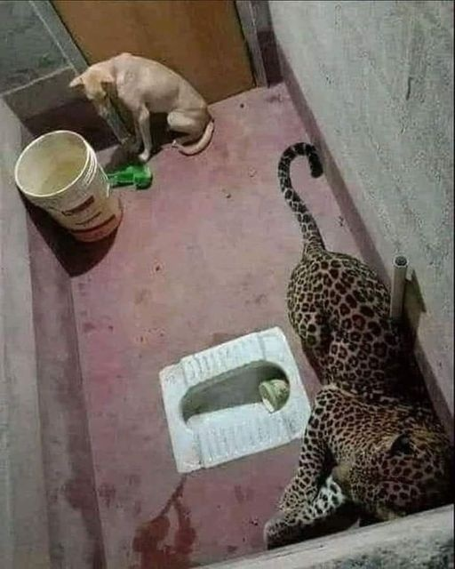

## 这起事件发生在印度卡纳塔克邦的Kombaru避难所。

豹子正在追赶狗，狗从窗户进入浴室，浴室从外面锁上了。

豹子跟在狗后面进来，两个人都被困在厕所里，狗看到豹子，慌了神，默默地坐在角落里。

他连叫都不敢叫。

豹子虽然饿了，追着狗跑，却没有吃它。

他本来可以跳到狗身上吃晚饭，但这两只动物在不同的角落里呆了将近12个小时。在这十二个小时里，豹子也保持着平静。

森林部门把注意力集中在这只豹子身上，并用麻醉镖将其捕获。

现在的问题是，为什么饥饿的豹子不攻击狗，而这是很容易的？

野生动物研究人员回答了这个问题：据他们说，野生动物对他们的自由非常敏感。

一旦他们意识到他们的自由被剥夺了，他们就会感到深深的痛苦，甚至忘记了他们的饥饿。

他们吃东西的自然动机开始消退。

自由和幸福是相通的。自由思考，行动和生活，如我们所愿