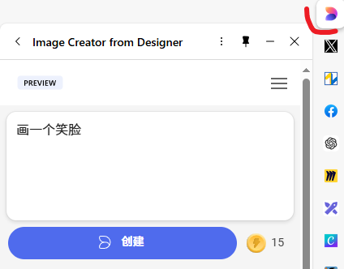

 
文生图（Text-to-Image）工具可以根据文字描述自动生成图像，目前有很多强大的平台可以帮助你实现这一目标。以下是几款推荐的文生图工具：

### 0. 使用 edge浏览器自带的工具

### 1. **DALL·E 2**  
   - **简介**：由OpenAI开发，DALL·E 2能够根据文字描述生成非常高质量的图像。用户可以通过输入描述来创作独特的艺术作品。
   - **特点**：
     - 可以生成非常复杂且具创意的图像。
     - 支持编辑和修改生成的图像。
   - **网址**：[OpenAI DALL·E](https://openai.com/dall-e)

### 2. **MidJourney**
   - **简介**：MidJourney是一个基于AI的创意图像生成工具，专注于艺术风格的图像生成。它非常适合制作风格化和抽象的艺术图像。
   - **特点**：
     - 可以生成独特且充满创意的艺术风格图像。
     - 提供强大的社区支持和交流，用户可以在Discord中进行互动和获取灵感。
   - **网址**：[MidJourney](https://www.midjourney.com/)

### 3. **Stable Diffusion**
   - **简介**：Stable Diffusion是一款开源的文本生成图像工具，因其开放源码和高效的图像生成能力，受到了广泛关注。用户可以在自己的硬件上运行该模型，或使用在线平台生成图像。
   - **特点**：
     - 支持高质量图像生成，并可以进行详细的风格和内容调整。
     - 开源，适合开发者和研究人员。
   - **网址**：[Stable Diffusion](https://stablediffusionweb.com/)

### 4. **Artbreeder**
   - **简介**：Artbreeder是一个可以生成艺术图像的在线平台，允许用户通过混合和编辑现有图像或生成的新图像，创造出独特的视觉效果。它不完全依赖于文本生成图像，但允许通过混合视觉元素来创造新的艺术作品。
   - **特点**：
     - 适合创建人脸、风景等类型的图像。
     - 提供简单的界面来编辑和混合图像。
   - **网址**：[Artbreeder](https://www.artbreeder.com/)

### 5. **Runway**
   - **简介**：Runway是一个强大的创意AI平台，提供了多种生成图像的工具，包括文本生成图像的功能。它适用于视频编辑、图像创作等多个创意工作领域。
   - **特点**：
     - 提供丰富的生成工具，包括基于文本的图像生成、视频编辑等。
     - 用户界面友好，适合创作者和设计师。
   - **网址**：[Runway](https://runwayml.com/)

### 6. **DeepAI**
   - **简介**：DeepAI提供了一款免费的文本生成图像工具，支持多种风格和主题的图像创作。它的界面简洁，用户可以轻松生成图像。
   - **特点**：
     - 简单易用，适合快速生成图像。
     - 支持多种艺术风格。
   - **网址**：[DeepAI Text-to-Image](https://deepai.org/machine-learning-model/text2img)

### 7. **Craiyon (原DALL·E Mini)**
   - **简介**：Craiyon是DALL·E Mini的免费版本，它允许用户输入文本生成图像。尽管生成的图像质量相对较低，但它是一个快速且免费的工具，适合进行快速创作和实验。
   - **特点**：
     - 免费使用，生成速度快。
     - 易于上手，适合日常创作和实验。
   - **网址**：[Craiyon](https://www.craiyon.com/)

### 8. **NightCafe**
   - **简介**：NightCafe是一个功能强大的艺术生成平台，提供文本生成图像的功能。它支持多种生成算法，包括VQGAN+CLIP和CLIP-guided Diffusion。
   - **特点**：
     - 支持多种生成风格，包括油画、抽象艺术、未来感风格等。
     - 用户可以通过积分系统获得免费生成次数。
   - **网址**：[NightCafe](https://creator.nightcafe.studio/)

---

### 总结：
- 如果你想要高质量且专业的图像生成，**DALL·E 2**和**MidJourney**是最为推荐的选择。
- 如果你偏好开源工具或希望自己动手操作，可以尝试**Stable Diffusion**。
- 如果你是创意设计者或艺术家，**Artbreeder**和**NightCafe**可能会给你带来更多创作灵感。

这些工具提供了不同风格和功能，可以根据你的需求和兴趣选择合适的平台进行创作！