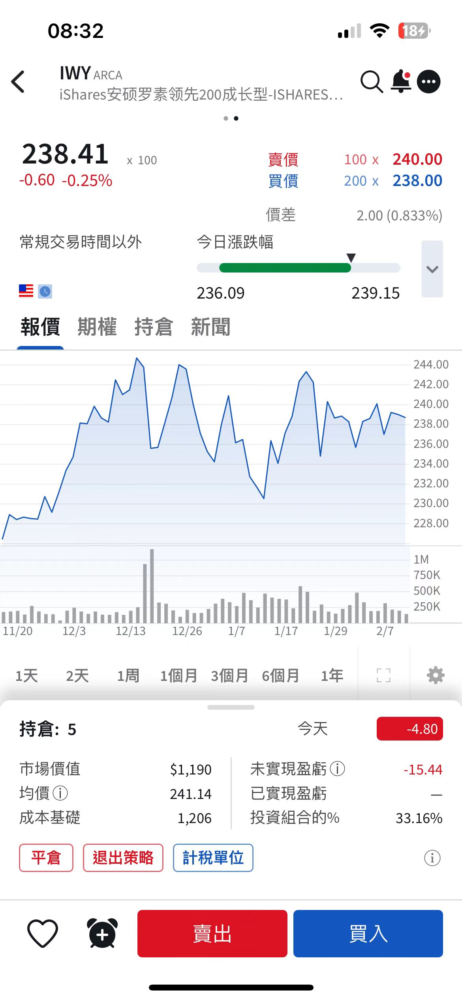

根据你提供的持仓信息，以下是详细分析：

---

### **关键数据总结**
1. **持仓数量**：5股  
2. **买入均价**：241.14美元/股  
3. **总成本**：5股 × 241.14 = **1,205.7美元**（约1,206美元）  
4. **当前股价**：238.41美元/股  
5. **当前市值**：5股 × 238.41 = **1,192.05美元**  
6. **未实现盈亏**：**-15.44美元**（亏损状态）  

---

### **盈亏计算**
- **每股亏损**：238.41（现价） - 241.14（买入价） = **-2.73美元**  
- **总亏损**：5股 × (-2.73) = **-13.65美元**  
- **与未实现盈亏差异**：系统显示的 **-15.44美元** 可能包含手续费或其他费用。

---

### **当前卖出操作**
1. **卖出价**：当前市场价为 **238.41美元/股**。  
2. **卖出总金额**：5股 × 238.41 = **1,192.05美元**。  
3. **实际亏损**：1,192.05 - 1,205.7 = **-13.65美元**（不含手续费）。

---

### **建议**
1. **亏损原因**：当前股价（238.41）低于买入均价（241.14），短期持有需关注市场波动。  
2. **是否卖出**：若判断未来股价可能继续下跌，可及时止损；若看好长期反弹，可继续持有。  
3. **费用注意**：实际卖出时需扣除交易手续费，可能进一步影响净收益。

---

### **总结**
- **当前状态**：亏损 **13.65~15.44美元**（具体以实际操作为准）。  
- **买入价**：**241.14美元/股**  
- **卖出价**：**238.41美元/股**  

建议结合市场趋势和个人风险承受能力决策是否卖出。