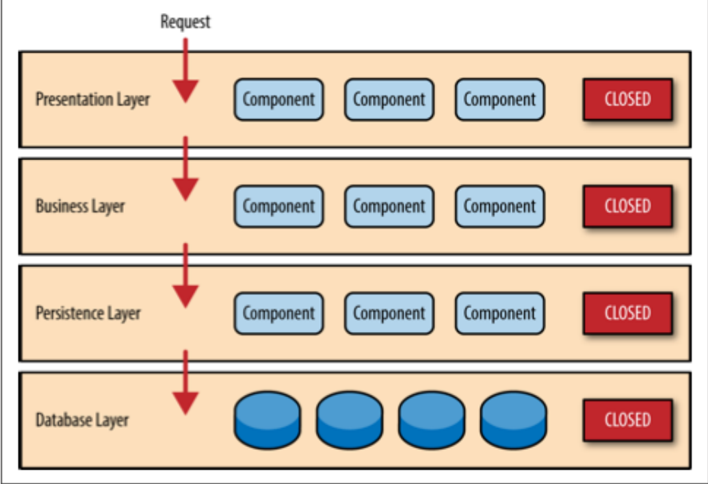
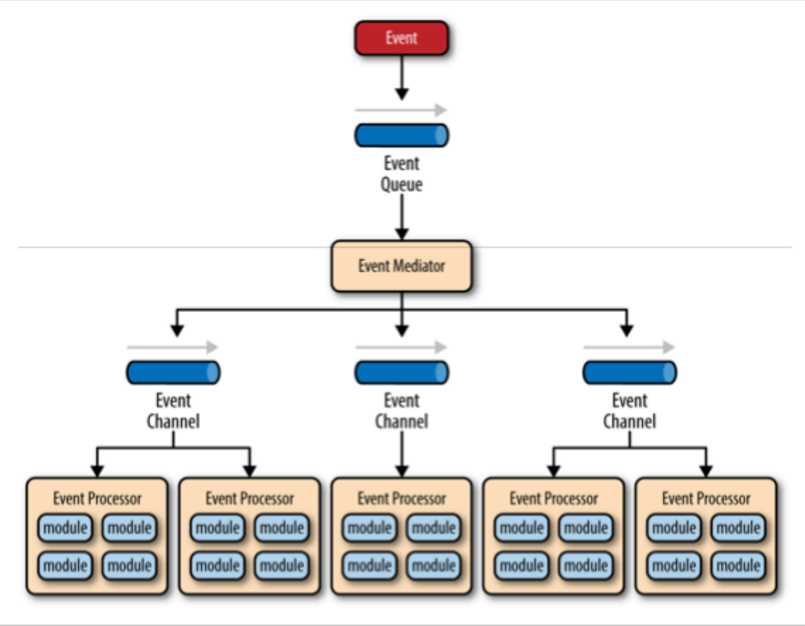
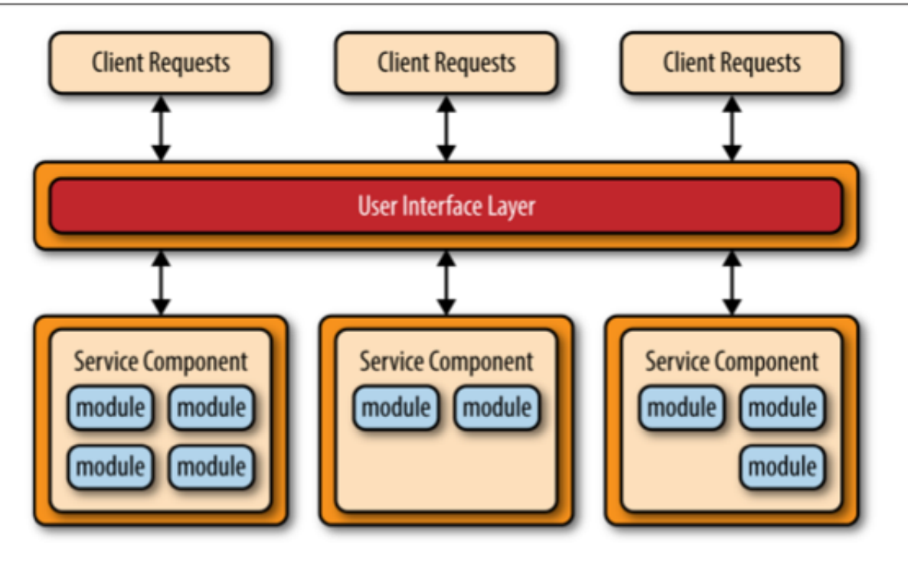
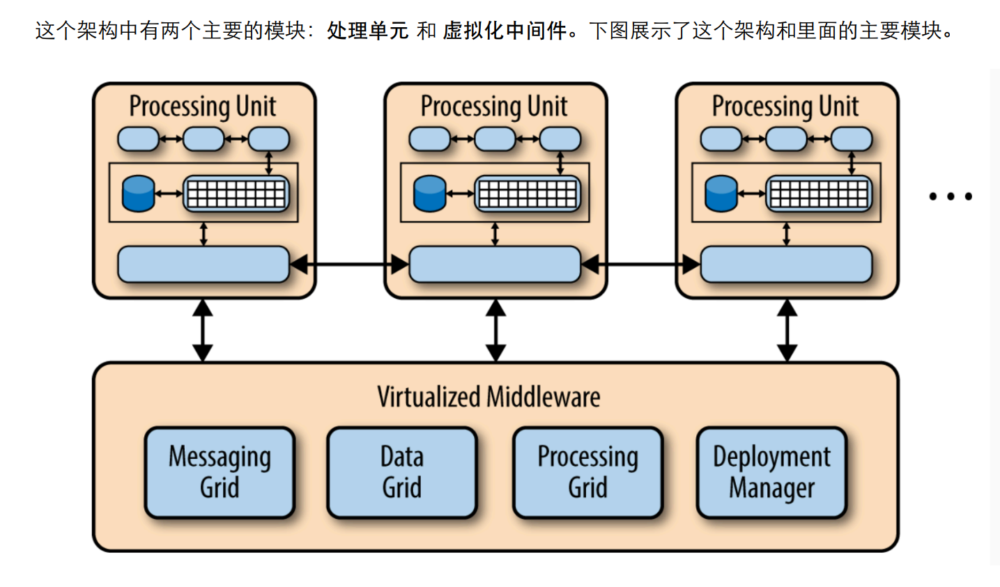

## 简介

软件架构模式：定义应用程序的基本特征和行为

## 第一章 分层架构

一般分成： 展示层、业务层、持久层、数据库层

每一层都是封闭的，request 必须一层一层传递

模式分析:
灵活性：低
易于部署：低
可测试性：高
性能：低
伸缩性：低
易开发性：容易

## 第二章 事件驱动架构

异步分发事件架构模式

## 第三章 微内核架构

## 第四章 微服务架构

## 第五章 基于空间的架构k
